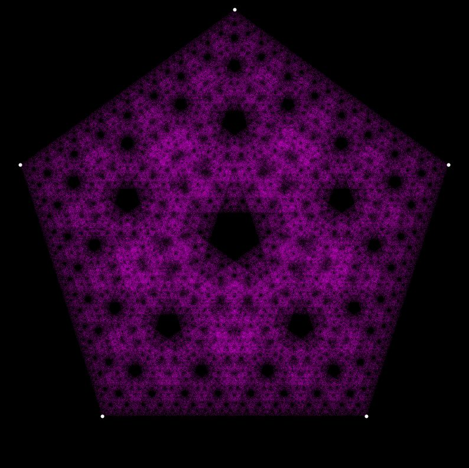

# Chaos-game

The chaos game is a method of creating a fractal, using a regular polygon and an initial point selected at random inside it.
The number of vertices of the regular polygon can be adjusted.

Example output for a regular pentagon:

